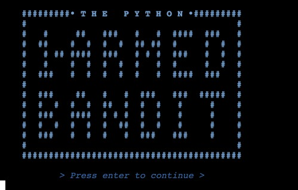
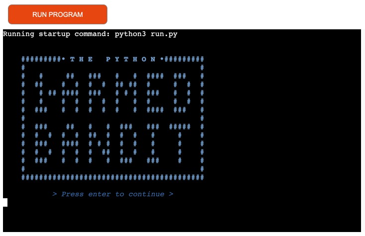
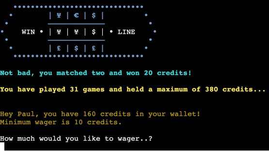
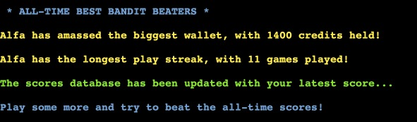

# **The Python One-Armed Bandit**

----

Visit the deployed application [here](https://python-bandit.herokuapp.com/).

## Table of Contents

----

PASTE ToC HERE

***

## USER EXPERIENCE (UX) 

### External User Goals: User Stories

- As a user, I want an easy-to-pick-up yet challeging game of chance to pass time online.
- As a user, I want to easily identify the input required for each step.
- As a user, I want to receive clear feedback in the case of erroneous inputs.
- As a user, I want the option to play the game as many times as I wish.
- As a user, I want to try and better the All-Time Bandit Buster score and see my name at the top!

  Additional ***user expectations*** for consideration include:
  - Responsive: access site easily on any device

### Project Goals

- To deploy a command-line application to a cloud-based platform.
- To create an online game of chance that is easy and fun play.
- To ensure the game runs in a smooth loop, allowing users to play as many times as they wish.
- To provide a positive UX by ensuring users are kept informed of their current in-game status.
- To provide a positive UX by ensuring that any user input errors are effectively dealt with.
- To include a process to track/record the best user scores for the game & display the all-time best.

----

## FLOWCHART

 

Flowchart generated in [LucidChart](https://lucidchart.com/)

---- 

## DESIGN CHOICES

### Colours

To enhance user experience the decision was taken to add colour, which was applied by utilising the built-in ASCI Escape Sequence syntax. White copy was retained for highlighting user input points and the reel win-line.

Other colours used were: 

  • **Red - \033[1;31;m** for validation warning messages and losing spins.
  
  • **Green - \033[1;32;m** for confirmation messages and x3 winning spins.
  
  • **Yellow - \033[1;33;m** for informative text & messages.

  • **Blue - \033[1;34;m** for the main logo, 'structural' elements (lines & boxes) and instructive copy.

  • **Cyan - \033[1;36;m** for confirmation of x2 winning spins; added to provide slight differentiation from x3 winning spins.

  The value of 1 in the examples above denote bold styling; variations of this value were utilised to achieve different text styles, specifically 3 for italics, 4 for underlines and 0 for resetting (normal-ising) text.

ASCI process and syntax informed by & referenced from: https://stackabuse.com/how-to-print-colored-text-in-python/

----

## TECHNOLOGIES

During the course of this project I have utilised the following technologies:

### Languages

- [**Python**](https://www.python.org/) was used to build the application

### Tools

- [**Git**](https://git-scm.com/) was used for version control (commit to Git and push to GitHub).

- [**Gitpod**](https://www.gitpod.io/) was used to write the code; an online IDE linked to the GitHub repository.

- [**GitHub**](https://github.com/) was used to create the repository and store the project's code after being pushed from Git.

- [**LucidChart**](https://lucidchart.com/) used to generate project flowchart.

- [**Google Cloud Platform**](https://cloud.google.com/) was used to connect & configure the APIs used in the project; specifically for Google Drive and Google Sheets integration, including generation of the required credentials file (creds.json).

- [**amiresponsive**](http://ami.responsivedesign.is/) was used to check how responsive the application is on different devices.

- [**PEP8**](http://pep8online.com/) **Python Validator** used to validate all Python source code.

- [**Heroku**](https://heroku.com/) used to configure and deploy the final project.

----

## FEATURES

### Background info & Introduction

- 

- 
  

- 

### Game Loop

- 
      
  

- 
      
  

- 

- 

- 

- 

### End-of-Game User Choices

- 

- 

- 
      

- 
      

### *Features to Implement*

- 

----

## VERSION CONTROL

Managed within **GitHub** and **Gitpod** via regular commits pushed to GitHub remote servers:

### Gitpod Workspaces
1. Starting from GitHub, clone the Code Institute template by clicking Use This Template and copying to my repo. Launch Workspace by clicking GitPod button - this action is only performed once and the workspace is subsequently reopened through GitPod.

2. Start the Gitpod Workspace which opens an online IDE editor window.
    
    - Update GitHub by committing from GitPod

3. During editing save the code regularly, using git add ., git commit -m "commit message here" and git push Bash commands to push changes to the GitHub repository.

4. Meaningful commit messages allow easy roll-back of any changes to earlier versions.

## TESTING 

### Testing Project Goals

- To deploy a command-line application to a cloud-based platform.

  

- To create an online game of chance that is easy and fun play.

  

- To ensure the game runs in a smooth loop, allowing users to play as many times as they wish.

- To provide a positive UX by ensuring users are kept informed of their current in-game status.

  

- To provide a positive UX by ensuring that any user input errors are effectively dealt with.

- To include a process to track/record the best user scores for the game & display the all-time best.

  

### Testing External User Goals & Stories

- As a user, I want an easy-to-pick-up yet challeging game of chance to pass time online.

  

- As a user, I want to easily identify the input required for each step.

- As a user, I want to receive clear feedback in the case of erroneous inputs.

- As a user, I want the option to play the game as many times as I wish.

- As a user, I want to try and better the All-Time Bandit Buster score and see my name at the top!

### Code Validation 

Python

- No errors were returned when passing through the [PEP8 validator](http://pep8online.com/)

### Response Testing

In order to test responsiveness to all device sizes, I used [amiresponsive](http://ami.responsivedesign.is/)

### Manual Testing

| FEATURE | OUTCOME | EXAMPLE | PASS/FAIL |
|---|---|:---:|:---:|
| Name Input | Validate value is |  | PASS |
| Name Input | Validate value is |  | PASS |
| Name Input | Validate value is |  | PASS |
| Name Input | Validate value is |  | PASS |
| Name Input | Validate value is |  | PASS |
| Name Input | Validate value is |  | PASS |
| Name Input | Validate value is |  | PASS |

## BUGS & FIXES

I am pleased to say that the application is, to the best of my knowledge following extensive testing, currently bug-free! One of the main bugs I encountered during the development of this project involved preventing unexpected results by restricting the user from "just hitting Enter" during the username input event:

### **Pressing Enter** during username input wasn't being caught...
  
  • *Issue:* Whilst playtesting during development it was discovered that "just pressing Enter" for username input wasn't being caught and allowed game continuation with a blank username...
  
  • *Fixed:* After much coding experimentation, followed by many fruitless googles, I eventually discovered this Stack Overflow thread: https://stackoverflow.com/questions/8761778/limiting-python-input-strings-to-certain-characters-and-lengths, which contained an example of using regular expressions and the re import. Method and base code was borrowed from here, ammended and utilised within the username validation process.

[Back to top ⇧](#)

## DEPLOYMENT

**Heroku** was used to deploy the final application by following these steps (from a modified process as originally utilised in the Love Sandwiches project):

• Create requirements.txt file using pip3 freeze > requirements.txt in console
• Commit changes; push to GitHub
• Go to Heroku website
• Click "Create new app" on Heroku dashboard
• Enter app name; choose region (Europe); create app
• Settings tab: "Reveal Config Vars"; add KEY: CREDS; paste contents of creds.json as VALUE
• Add Config Var KEY: PORT with VALUE: 8000.
• Under "Buildpacks" section select Python; save changes
• Add NodeJS buildpack using the process above
• Deploy tab: "Deployment method", select GitHub; connect
• Search the repository to be deployed (portfolio-project-three); connect
• Enable Automatic Deploys; initial Manual Deploy of application

Link to the deployed application [here](https://python-bandit.herokuapp.com/). 

# CREDITS

Much appreciation and thanks to my mentor, Marcel Mulders, for his continued advice, support and encouragement.

## Content

• **One-Armed Bandit copy & info** sourced from: https://en.wiktionary.org/wiki/one-armed_bandit

• **ASCI color theory & syntax** referenced from: https://stackabuse.com/how-to-print-colored-text-in-python/

• **Refresh of Python dictionary knowledge** referenced from: https://www.geeksforgeeks.org/python-get-the-first-key-in-dictionary/?ref=rp

• **Input validation for catching just hitting Enter** utilises code sourced & repurposed from: https://stackoverflow.com/questions/8761778/limiting-python-input-strings-to-certain-characters-and-lengths

• **Google Cloud Platform** process for activating APIs and obtaing creds.json was achieved by re-referencing & revisiting the Love Sandwiches project.

